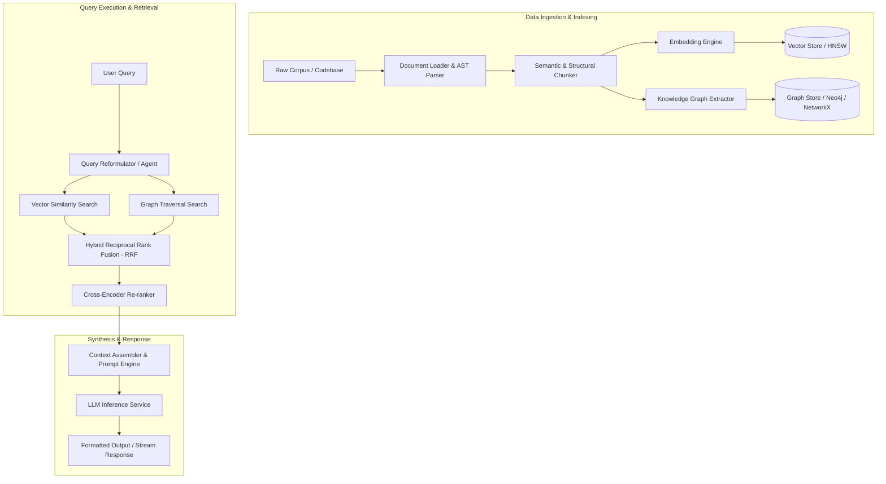

# CorpusMind: High-Performance Knowledge Corpus Intelligence & RAG System

## 1. Executive Summary & Overview
**CorpusMind** is an enterprise-grade, high-performance Retrieval-Augmented Generation (RAG) and Knowledge Intelligence engine. It enables semantic search, structured graph reasoning, hybrid retrieval, and contextual LLM generation across vast document corpora and complex codebases.

CorpusMind is built following strict Object-Oriented Programming (OOP) principles, modular architecture, optimized computational paths, and comprehensive documentation as defined in [`code_rules.md`](code_rules.md).

---

## 2. Problem Statement & Target Audience

### Problem
As codebases and document repositories grow into millions of tokens, standard text search and naive vector RAG suffer from:
- Context fragmentation and loss of structural relationships across files/modules.
- High retrieval latency and low precision/recall on multi-hop questions.
- Monolithic, rigid code structures that are difficult to optimize or extend.

### Who Has It
- **Software Engineers & Technical Leads:** Navigating massive legacy codebases and complex system architectures.
- **Researchers & Domain Experts:** Synthesizing insights from large technical document corpora.
- **Enterprise AI Developers:** Building custom internal knowledge platforms requiring privacy, speed, and strict accuracy.

---

## 3. Measurable Outcome (Outcome Rule)
- **Primary Deliverable:** A fully modular Python/TypeScript library with CLI and REST API endpoints.
- **Checkable Metrics:** 
  - Sub-50ms hybrid retrieval latency on 100k+ document chunks.
  - Reproducible eval benchmark run demonstrating >85% RAG Triad score (Context Relevance, Groundedness, Answer Relevance).
  - Clean CLI demonstration under 60 seconds showing multi-hop codebase query resolution.

---

## 4. Architecture & System Design

---

## 5. Key System Components & OOP Design

1. **Ingestion Manager (`CorpusLoader` & `ASTChunker`)**
   - *Responsibility:* Parsing documents, code files, and metadata into unified, typed `DocumentChunk` abstractions.
   - *OOP Pattern:* Strategy Pattern for document loaders (Markdown, Code, PDF, HTML).

2. **Vector & Graph Storage Interfaces (`IVectorStore` & `IGraphStore`)**
   - *Responsibility:* Decoupled indexing and query interfaces supporting pluggable backends (e.g., Qdrant/FAISS/Chroma for vectors; NetworkX/Neo4j for graphs).
   - *OOP Pattern:* Interface Segregation & Dependency Inversion.

3. **Hybrid Retriever Engine (`HybridRetriever`)**
   - *Responsibility:* Fusing dense vector similarity search with sparse/lexical (BM25) and graph traversal search using Reciprocal Rank Fusion (RRF).
   - *OOP Pattern:* Composite & Pipeline Patterns.

4. **Re-ranker & Context Synthesizer (`ContextSynthesizer`)**
   - *Responsibility:* Re-ranking candidate chunks using cross-encoders and constructing optimal context windows for downstream LLM inference.
   - *OOP Pattern:* Builder & Decorator Patterns.

---

## 6. Tracks Exercised
- [x] **System Design:** Layered, decoupled clean architecture with interfaces, modular modules, and low-latency storage access.
- [x] **Agentic AI:** Multi-step query expansion, self-correction, and tool-augmented context selection.
- [x] **Machine Learning / LLMs:** Embedding generation, cross-encoder re-ranking, and RAG evaluation metrics (TruLens/Ragas framework).

---

## 7. Development Guidelines & System Integration
All development within CorpusMind must adhere strictly to [`code_rules.md`](code_rules.md):
- **Object-Oriented Focus:** Core domain logic must be encapsulated within classes with explicit interfaces.
- **Documentation:** Every class, method, and protocol must feature full type annotations and clear docstrings.
- **Performance Optimization:** Vector operations must be vectorized (NumPy/PyTorch/BLAS acceleration) with minimal redundant memory copies.
- **Modularity:** Package components cleanly under `corpusmind/core`, `corpusmind/retrieval`, `corpusmind/storage`, and `corpusmind/api`.
