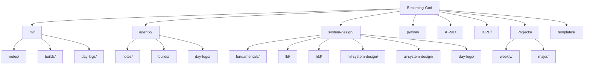

# Becoming God

A personal learning workspace: daily practice and shipped projects across machine
learning, agentic systems, system design, and competitive programming.

## Progress

| Track | Topics covered | Projects shipped |
|---|---|---|
| ML | 1 day of notebooks (digit prediction, PyTorch basics, bigram language model) | 0 |
| Agentic | Tool-use pattern, reflection pattern | 0 |
| System design | — | 0 |
| ICPC (competitive programming) | 3 days, 24 problems solved | — |

Projects shipped counts only projects with a filled-in `project-brief.md` OUTCOME. See
[Projects/README.md](Projects/README.md) for the rule.

## Projects

No projects have a declared outcome yet. `Projects/chatgpt-from-scratch/` exists but
predates the outcome rule and has no `project-brief.md` — see
[Projects/README.md](Projects/README.md).

## Learning tracks

- [ml/](ml/) — machine learning notes, builds, and daily logs.
- [agentic/](agentic/) — agentic systems notes, builds, and daily logs.
- [system-design/](system-design/) — fundamentals, LLD, HLD, ML system design, AI system design.
- [python/](python/) — general Python toolbelt and exercises.
- [AI-ML/](AI-ML/) — day-by-day ML/AI notebook exercises (uv-managed Python environment).
- [ICPC/](ICPC/) — competitive programming practice, organized by day.
- [Projects/](Projects/) — shipped projects, weekly and major, each requiring a declared outcome.
- [templates/](templates/) — day-log, design-doc, and project-brief templates used across this repo.

## Structure

