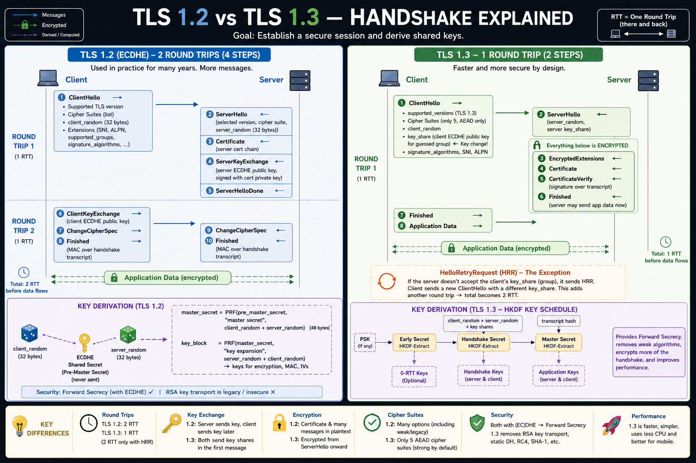

# Request Lifecycle: TLS 1.2 vs TLS 1.3 Handshake Explained



## Overview & Core Goal

The primary goal of a **TLS Handshake** in the HTTP request lifecycle is to authenticate the communicating parties (usually client and server) and establish a secure, encrypted session by deriving shared symmetric keys.

- **RTT (Round Trip Time)**: The time it takes for a signal/packet to go from the client to the server and back.

---

## 1. TLS 1.2 Handshake (ECDHE) – 2 RTT (4 Steps)

TLS 1.2 has been used in practice for many years. It requires **2 Round Trips (2 RTT)** before application data can start flowing.

```
Client                                                   Server
  |                                                         |
  |------------------- 1. ClientHello --------------------->|  [Round Trip 1]
  |<------------------ 2. ServerHello ----------------------|
  |<------------------ 3. Certificate ----------------------|
  |<-------------- 4. ServerKeyExchange --------------------|
  |<----------------- 5. ServerHelloDone -------------------|
  |                                                         |
  |----------------- 6. ClientKeyExchange ----------------->|  [Round Trip 2]
  |------------------ 7. ChangeCipherSpec ----------------->|
  |-------------------- 8. Finished ----------------------->|
  |<----------------- 9. ChangeCipherSpec ------------------|
  |<------------------- 10. Finished -----------------------|
  |                                                         |
  |============ Application Data (Encrypted) ===============|
```

### Handshake Flow Steps
1. **ClientHello** $\rightarrow$: Sends supported TLS versions, cipher suites list, `client_random` (32 bytes), and extensions (`SNI`, `ALPN`, `supported_groups`, `signature_algorithms`).
2. **ServerHello** $\leftarrow$: Server selects version, cipher suite, and sends `server_random` (32 bytes).
3. **Certificate** $\leftarrow$: Server sends its certificate chain for authentication.
4. **ServerKeyExchange** $\leftarrow$: Server sends ephemeral ECDHE public key signed with its private certificate key.
5. **ServerHelloDone** $\leftarrow$: Server signals end of initial negotiation.
6. **ClientKeyExchange** $\rightarrow$: Client sends its ephemeral ECDHE public key.
7. **ChangeCipherSpec** $\rightarrow$: Client signals transition to encrypted communication.
8. **Finished** $\rightarrow$: Client sends a MAC over the handshake transcript.
9. **ChangeCipherSpec** $\leftarrow$: Server signals transition to encrypted communication.
10. **Finished** $\leftarrow$: Server sends a MAC over the handshake transcript.

### Key Derivation (TLS 1.2)
- **Inputs**: `client_random` (32 bytes) + `server_random` (32 bytes) + **ECDHE Shared Secret (Pre-Master Secret)** (never transmitted over network).
- **Master Secret**: $\text{master\_secret} = \text{PRF}(\text{pre\_master\_secret}, \text{"master secret"}, \text{client\_random} + \text{server\_random}) \quad \text{[48 bytes]}$
- **Key Block**: $\text{key\_block} = \text{PRF}(\text{master\_secret}, \text{"key expansion"}, \text{server\_random} + \text{client\_random}) \rightarrow \text{Keys for encryption, MAC, IVs}$
- **Security**: Provides **Forward Secrecy** when using ECDHE. Static RSA key transport is considered legacy and insecure ($\times$).

---

## 2. TLS 1.3 Handshake – 1 RTT (2 Steps)

TLS 1.3 is faster and significantly more secure by design. In the standard flow, it completes in **1 Round Trip (1 RTT)**.

```
Client                                                   Server
  |                                                         |
  |------------------- 1. ClientHello --------------------->|  [Round Trip 1]
  |      (includes key_share: client ECDHE public key)       |
  |<------------------ 2. ServerHello ----------------------|
  |      (includes key_share: server ECDHE public key)       |
  |                                                         |
  |   ---------------- Everything Below is ENCRYPTED ------ |
  |<-------------- 3. EncryptedExtensions -------------------|
  |<------------------ 4. Certificate ----------------------|
  |<-------------- 5. CertificateVerify --------------------|
  |<------------------- 6. Finished ------------------------|
  |                                                         |
  |-------------------- 7. Finished ----------------------->|
  |---------------- 8. Application Data ------------------->|
  |                                                         |
  |============ Application Data (Encrypted) ===============|
```

### Handshake Flow Steps
1. **ClientHello** $\rightarrow$: Sends supported versions (`TLS 1.3`), cipher suites (only 5 AEAD suites allowed), `client_random`, extensions (`SNI`, `ALPN`, `signature_algorithms`), and crucially: a **`key_share`** containing the client's ECDHE public key for a guessed group.
2. **ServerHello** $\leftarrow$: Server selects the cipher suite, sends `server_random` and its matching **`key_share`**.
3. **Encrypted Extensions & Auth** $\leftarrow$: All subsequent messages from the server are encrypted using Handshake Keys:
   - **EncryptedExtensions**
   - **Certificate** (server cert chain)
   - **CertificateVerify** (signature over the entire transcript proving key ownership)
   - **Finished** (server finished MAC; server can start sending app data right after this)
4. **Finished & App Data** $\rightarrow$: Client verifies, sends its **Finished** MAC, and starts sending **Application Data**.

### Key Derivation (TLS 1.3 – HKDF Key Schedule)
TLS 1.3 replaces the custom PRF with standard **HKDF (HMAC-based Extract-and-Expand Key Derivation Function)**:
1. **Early Secret** $\leftarrow \text{HKDF-Extract}(\text{PSK})$ $\rightarrow$ **0-RTT Keys** (Optional 0-RTT session resumption).
2. **Handshake Secret** $\leftarrow \text{HKDF-Extract}(\text{client\_random} + \text{server\_random} + \text{key\_shares})$ $\rightarrow$ **Handshake Keys** (Encrypts server cert, CertificateVerify, Finished).
3. **Master Secret** $\leftarrow \text{HKDF-Extract}(\text{transcript hash})$ $\rightarrow$ **Application Keys** (Encrypts application data).

### HelloRetryRequest (HRR) – The 2 RTT Exception
If the server does not support the client's initial `key_share` group, the server responds with a **`HelloRetryRequest` (HRR)**.
The client then sends a new `ClientHello` with a key share for a group supported by the server. This adds 1 RTT, bringing total handshake time to **2 RTT**.

---

## 3. Key Differences at a Glance

| Feature | TLS 1.2 (ECDHE) | TLS 1.3 |
| :--- | :--- | :--- |
| **Round Trips (Latency)** | **2 RTT** before data flows | **1 RTT** (2 RTT only with HelloRetryRequest) |
| **Key Exchange** | Server sends key in Step 4, Client sends key in Step 6 | Both Client & Server send key shares in the 1st exchange |
| **Handshake Encryption** | Certificate & handshake messages sent in **plaintext** | Handshake encrypted from **`ServerHello` onward** |
| **Cipher Suites** | Many choices, including weak/legacy (CBC, RC4, 3DES) | Streamlined to **only 5 AEAD cipher suites** (e.g., AES-GCM, CHACHA20-POLY1305) |
| **Security Guarantees** | Forward Secrecy optional; permits static RSA key transport | **Forward Secrecy mandatory**; removes RSA transport, static DH, SHA-1, RC4 |
| **Performance & CPU** | Higher latency, more CPU overhead | **Faster**, lower CPU usage, optimized for mobile networks |

---

## Summary

In modern system architecture and network lifecycles, **TLS 1.3** is the standard protocol for securing transport layer communication. By sending key shares up front in the initial `ClientHello`, TLS 1.3 eliminates an entire round trip (reducing connection establishment from **2 RTT to 1 RTT**), encrypts the server certificate during negotiation, and eliminates legacy vulnerable ciphers.
