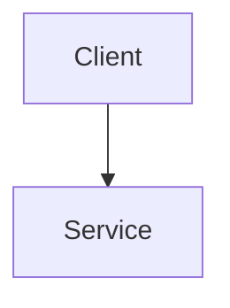

# Design Doc Template

Copy this file when starting a new system design writeup (LLD, HLD, ML system design, or AI system design).

## Problem

## Requirements

### Functional

### Non-functional

## Scale estimates

## API

## Data model

## Architecture diagram

## Deep dive

## Tradeoffs

## What changes at 10x
