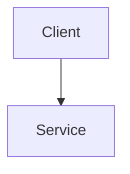

# Project Brief Template

Copy this file to `<project-folder>/project-brief.md` and fill in every field, especially
OUTCOME, **before writing any code**. See `Projects/README.md` for the outcome rule.

## Problem

## Who has it

## OUTCOME

Must be externally checkable by someone who isn't you: a live URL, a published benchmark
table from a real eval run, a merged PR, or a demo recording under 90 seconds.
"The code works" is not an outcome.

## Architecture diagram

## Tracks exercised

- [ ] ML
- [ ] Agentic
- [ ] System design

## Eval method + numbers

## Resume line

One sentence, must contain a number.
